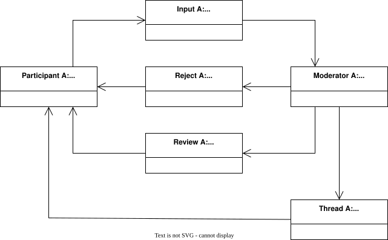

# Design

## Structure

## Threads

Message repository

- Persistent via configuration
- Cannot be constructed

### Backed

- sqlite: persists into database file
- memory: caches into collection
- null: immediately discards

## Participants

- Persistent via configuration
- Cannot be constructed

### Console

### OpenAI

### Moderator

### Twitch

## Repositories

## Logical constructs

Blocks and communication patterns

### Pipe

### Cache

### Notification channel

### Moderated channel

