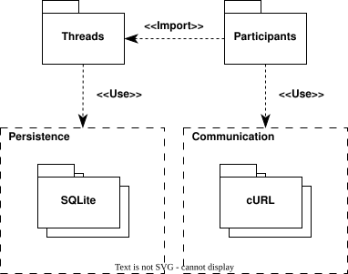
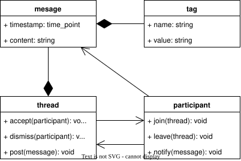
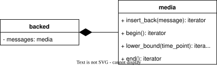
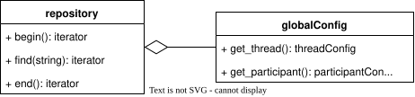

# Design

## Structure

## Threads

Message repository

- Persistent via configuration
- Cannot be constructed

### Backed

- null: immediately discards
- memory: caches into collection
- file: persists into text file
- sqlite: persists into database file

## Participants

- Persistent via configuration
- Cannot be constructed

### Console

- Singleton

### OpenAI

### Moderator

### Twitch

## Repositories

## Logical constructs

Blocks and communication patterns

### Pipe

### Cache

### Solid

### Notification channel

### Moderated speech

### Control interface

